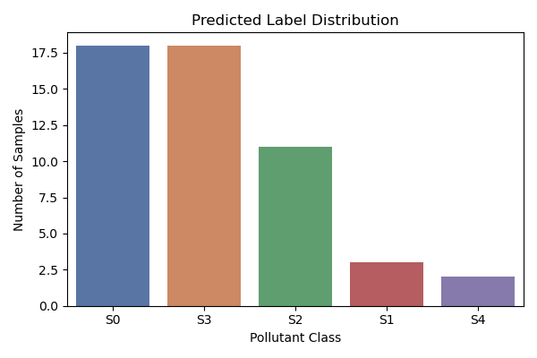

# 🧪 Pollutant Prediction in Construction Materials

This project builds a machine learning system to predict **pollutant classifications** in building materials based on ÖKOBAUDAT data, material roles, and end-of-life scenarios. It supports more efficient sustainability assessments and helps automate pollutant detection for circular construction tools.

---

## 🧩 Problem Statement

Current sustainability assessments rely on manual inputs to determine which pollutants (e.g., adhesives, coatings, fire retardants) are present in construction materials. This process is:
- Time-consuming
- Error-prone
- Not scalable

Our solution: A trained model that **automatically predicts pollutant presence** based on a material’s characteristics and context.

---

## 🔍 Objectives

- Predict `Störstoffklasse` (pollutant classes: S0–S4)
- Suggest likely **contaminant terms** using text mining
- Blend predictions with **component-level** context from `bauteileditor.de`
- Provide strong default values to reduce manual input

---

## 🧱 Dataset

- `pollutant_labeled_obd.csv`: bootstrapped multi-label pollutant annotations
- `tBaustoff_with_OBD_mapping.csv`: technical building materials
- `all_uuid_materials_from_components.csv`: links materials to components
- Manual + scraped data from [bauteileditor.de](https://bauteileditor.de)

---

## 🧠 Model Pipeline

### 1. `build_features.py`
- Loads datasets
- Infers material role from text (e.g. adhesive, sealant, mortar)
- One-hot encodes EOL scenarios and other categorical features

### 2. `train_pollutant_model.py`
- Trains a `MultiOutputClassifier` using Random Forest
- Saves model + predictions + probability scores

### 3. `inference_pipeline.py`
- Makes predictions on unlabeled materials
- Applies class-specific thresholds
- Blends material-level and component-level probabilities

### 4. `visualize_results.py`
- Generates performance barplots and label distributions
- Saves top predicted pollutant classes for inspection

---

## 📁 Project Structure

```
bbsr-challenge/
│
├── data/                    # Raw and processed datasets
├── results/
│   └── figures/             # Plots, metrics, top predictions
├── src/
│   └── pollutant_predictor/
│       ├── data/           # Dataset loading utilities
│       ├── features/       # Role inference + preprocessing
│       ├── models/         # Training + evaluation functions
│       └── inference/      # Prediction and blending pipeline
├── scripts/                # Executable scripts
│   ├── train_pollutant_model.py
│   ├── visualize_results.py
│   └── ...
├── .env                    # SESSION_COOKIE and driver path
└── README.md
```

---

## 📊 Example Outputs

### Model Performance


### Predicted Label Distribution


---

## ⚙️ Environment Setup

Create and activate a new environment:
```bash
conda create -n bbsr-env python=3.12
conda activate bbsr-env
```

Install required packages:
```bash
pip install -r requirements.txt
```

Create a `.env` file with:
```
SESSION_COOKIE=your_session_cookie_here
CHROMEDRIVER_PATH=/usr/local/bin/chromedriver
```

Run:
```bash
PYTHONPATH=src python scripts/train_pollutant_model.py
PYTHONPATH=src python scripts/visualize_results.py
```

---

## ⚙️ Quick Setup with Make

You can run common tasks using `make`:

```bash
# Install dependencies (requires conda)
make setup

# Train the model
make train

# Run predictions
make inference

# Generate performance plots and outputs
make visualize

# Do it all
make all


## 📈 Performance (Test Set)

| Class | Precision | Recall | F1-score |
|-------|-----------|--------|----------|
| S0    | 0.94      | 1.00   | 0.97     |
| S1    | 1.00      | 1.00   | 1.00     |
| S2    | 0.91      | 0.91   | 0.91     |
| S3    | 0.78      | 1.00   | 0.88     |
| S4    | 0.50      | 0.33   | 0.40     |

**Macro F1:** 0.83 | **Micro F1:** 0.90

---

## ✅ Next Steps

- Improve contaminant prediction with TF-IDF + logistic regression
- Use semi-supervised learning to expand labels
- Deploy in a circularity tool for interactive pollutant suggestions

---

## 🤝 Credits

Developed as part of the [BBSR Challenge](https://nextcoder.de), in collaboration with Nextcoder and Circularity Tools initiative.