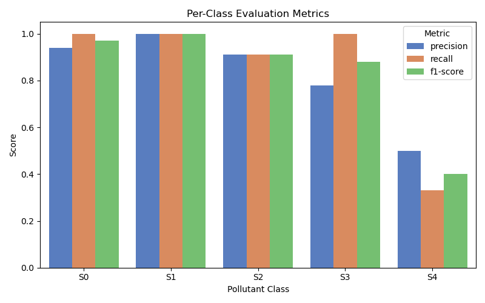

# 🧪 Pollutant Prediction in Construction Materials

This project builds a machine learning system to predict **pollutant classifications** in building materials based on ÖKOBAUDAT data, material roles, and end-of-life scenarios. It supports more efficient sustainability assessments and helps automate pollutant detection for circular construction tools.

---

## 🧩 Problem Statement

Current sustainability assessments rely on manual inputs to determine which pollutants (e.g., adhesives, coatings, fire retardants) are present in construction materials. This process is:
- Time-consuming
- Error-prone
- Not scalable

Our solution: A trained model that **automatically predicts pollutant presence** based on a material’s characteristics and context.

---

## 🔍 Objectives

- Predict `Störstoffklasse` (pollutant classes: S0–S4)
- Suggest likely **contaminant terms** using text mining
- Blend predictions with **component-level** context from `bauteileditor.de`
- Provide strong default values to reduce manual input

---

## 📦 Datasets

This project works with multiple datasets related to construction materials and pollutants:

### 🔹 Raw Input Files

-  The ÖKOBAUDAT contains life cycle assessment (LCA) data on building materials, construction, transport, energy, and disposal processes. Three versions are provided:
    - `OBD_2024_I.csv`
    - `OBD_2023_I.csv`
    - `OBD_2020_II.csv`

***Notes on ÖKOBAUDAT Data:***

Each dataset contains environmental impact indicators organized by lifecycle phases
Material entries include detailed technical specifications and reference quantities
Data follows standardized categories based on international norms (EN 15804)
UUID identifiers ensure consistent referencing across different datasets

- `tBaustoff_with_OBD_mapping.csv` — Provides material mapping information with 10 columns. It connects to the ÖKOBAUDAT dataset through process UUIDs and contains end-of-life scenario information for various materials.

- `pollutant_combinations.csv`- contains:
    - Building Materials: Various construction materials (concrete, wood, insulation, etc.)
    - Disturbing Substances: Descriptions of potential contaminants or foreign materials
    - Disturbance Classes: Classification from S0 (no disturbance) to S4 (highly problematic)
    - This dataset helps assess how different material combinations affect recycling potential and environmental impact, which is crucial for circular construction practices.


### 🔹 Processed Datasets

Processed and cleaned versions are stored in `data/processed/`:

- `pollutant_labeled_obd_translated.csv` — Translated and cleaned pollutant-labeled data
- `tbs_deduped.csv` — Deduplicated TBS materials with inferred roles
- `all_uuid_materials_from_components.csv`: scraped data from [bauteileditor.de](https://bauteileditor.de). Maps building components (for example, wall) with construction materials


---

## 🧠 Model Pipeline

### 1. `build_features.py`
- Loads datasets
- Infers material role from text (e.g. adhesive, sealant, mortar)
- One-hot encodes EOL scenarios and other categorical features

### 2. `train_pollutant_model.py`
- Trains a `MultiOutputClassifier` using Random Forest
- Saves model + predictions + probability scores

### 3. `inference_pipeline.py`
- Makes predictions on unlabeled materials
- Applies class-specific thresholds
- Blends material-level and component-level probabilities

### 4. `visualize_results.py`
- Generates performance barplots and label distributions
- Saves top predicted pollutant classes for inspection

---

## 📁 Project Structure

```
bbsr-challenge/
│
├── data/                    # Raw and processed datasets
├── results/
│   └── figures/             # Plots, metrics, top predictions
├── src/
│   └── pollutant_predictor/
│       ├── data/           # Dataset loading utilities
│       ├── features/       # Role inference + preprocessing
│       ├── models/         # Training + evaluation functions
│       └── inference/      # Prediction and blending pipeline
├── scripts/                # Executable scripts
│   ├── train_pollutant_model.py
│   ├── visualize_results.py
│   └── ...
├── .env                    # SESSION_COOKIE and driver path
└── README.md
```

---

## 📊 Example Outputs

### Model Performance


### Predicted Label Distribution


---

## ⚙️ Environment Setup

Create and activate a new environment:
```bash
conda create -n bbsr-env python=3.12
conda activate bbsr-env
```

Install required packages:
```bash
pip install -r requirements.txt
```

Create a `.env` file with:
```
SESSION_COOKIE=your_session_cookie_here
CHROMEDRIVER_PATH=/usr/local/bin/chromedriver
```

Run:
```bash
PYTHONPATH=src python scripts/train_pollutant_model.py
PYTHONPATH=src python scripts/visualize_results.py
```

---

## ⚙️ Quick Setup with Make

You can run common tasks using `make`:

```bash
# Install dependencies (requires conda)
make setup

# Train the model
make train

# Run predictions
make inference

# Generate performance plots and outputs
make visualize

# Do it all
make all


## 📈 Performance (Test Set)

| Class | Precision | Recall | F1-score |
|-------|-----------|--------|----------|
| S0    | 0.94      | 1.00   | 0.97     |
| S1    | 1.00      | 1.00   | 1.00     |
| S2    | 0.91      | 0.91   | 0.91     |
| S3    | 0.78      | 1.00   | 0.88     |
| S4    | 0.50      | 0.33   | 0.40     |

**Macro F1:** 0.83 | **Micro F1:** 0.90

---

## ✅ Next Steps

- Improve contaminant prediction with TF-IDF + logistic regression
- Use semi-supervised learning to expand labels
- Deploy in a circularity tool for interactive pollutant suggestions

---

## 🤝 Credits

Developed as part of the [BBSR Challenge](https://nextcoder.de), in collaboration with Nextcoder and Circularity Tools initiative.